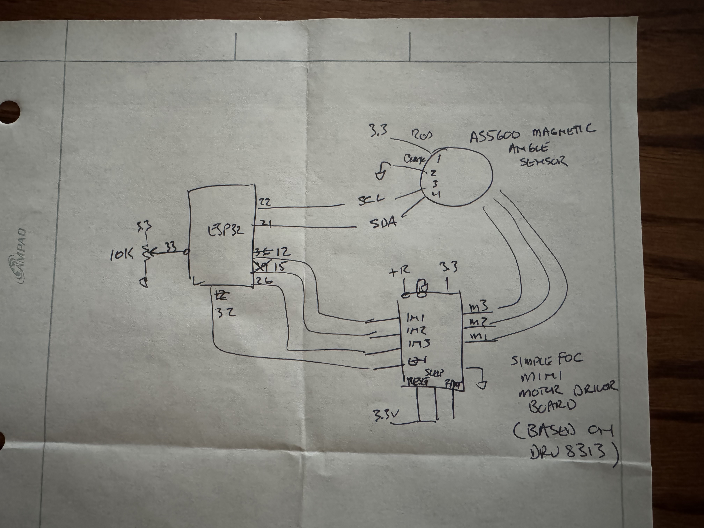
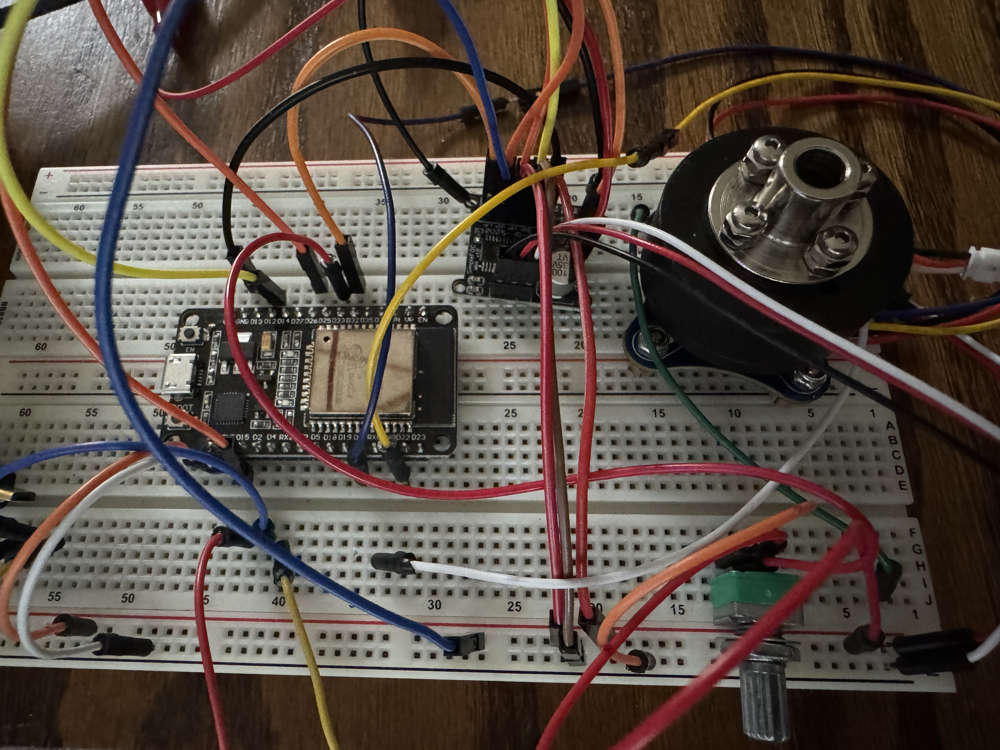

### BLDC_2804
Tests BLDC_2804 brushless outrunner motor using SimpleFOC library
The code uses velocity control mode.  A 10K pot controls the target rpm (50-400 range).
The target and measured rpm is displayed on the serial monitor.

### Hardware assumptions:
 Hardware Details:
 * Uses BLDC 2804 outrunner brushless motor with integrated AS5600 position encoder.  
 * Uses SimpleFOC mini motor driver board.
 * Uses ESP32 to control everything.

 This code was generated by chatGPT.  
 dlf 4/25/2026

### Schematics

### Build Pictures

